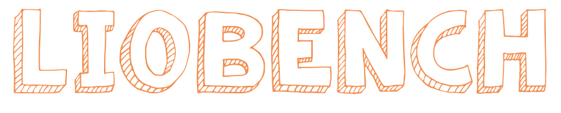

---

<div>
  <h3 align="center">Reproducible LiDAR-Inertial Odometry: Are We There Yet?</h3>

  <p align="center">:raised_eyebrow:<i> Do the experimental numerical results of LIO systems credibly support their effectiveness?</i>
    <br />
    <a href="https://natsu-akatsuki.github.io/LIOBench/#/"><strong>Explore the docs »</strong></a>
    <br />
    <br />
    <a href="https://github.com/Natsu-Akatsuki/LIO-Benchmark/issues/new?assignees=&labels=bug&projects=&template=bug-report---.md">Report Bug</a>
    ·
    <a href="https://github.com/Natsu-Akatsuki/LIO-Benchmark/issues/new?assignees=&labels=enhancement&projects=&template=feature-request---.md">Request Feature</a>
  </p>

</div>

---

## Citation

If you find this project useful in your research, please consider cite:

```
@misc{liobench2024,
    title={Reproducible LiDAR-Inertial Odometry: Are We There Yet?},
    howpublished = {\url{https://github.com/LIO-Benchmark/LIOBench}},
    year={2024}
}
```

## Contact

hong877381@gmail.com

<p align="right">(<a href="#readme-top">back to top</a>)</p>
